# ESPECIFICACIONES TÉCNICAS: MAPA CONCEPTUAL - NÚMEROS PRIMOS, MCM Y MCD

## 1. ESTRUCTURA JERÁRQUICA DEL DIAGRAMA

### **Nivel 1 - Concepto Central**
- **Nodo**: "NÚMEROS PRIMOS, MCM Y MCD"
- **Posición**: Centro superior
- **Conexiones**: Conecta con todos los conceptos principales del Nivel 2

### **Nivel 2 - Conceptos Principales**
- **NÚMEROS PRIMOS Y COMPUESTOS** (izquierda superior)
- **CRITERIOS DE DIVISIBILIDAD** (derecha superior)
- **DESCOMPOSICIÓN FACTORIAL** (izquierda media)
- **MÁXIMO COMÚN DIVISOR (MCD)** (centro inferior)
- **MÍNIMO COMÚN MÚLTIPLO (MCM)** (derecha inferior)

### **Nivel 3 - Sub-conceptos Primarios**
**De NÚMEROS PRIMOS Y COMPUESTOS:**
- Números Primos
- Números Compuestos
- Concepto de Divisor

**De CRITERIOS DE DIVISIBILIDAD:**
- Divisibilidad por 2
- Divisibilidad por 3
- Divisibilidad por 5
- Divisibilidad por 7
- Divisibilidad por 11

**De DESCOMPOSICIÓN FACTORIAL:**
- Factores Primos
- Teorema Fundamental de la Aritmética
- Método de División Sucesiva

### **Nivel 4 - Sub-conceptos Secundarios**
**De Números Primos:**
- Mayor que 1
- Solo dos divisores
- 1 y él mismo
- Ejemplos: 2, 3, 5, 7, 11

**De Números Compuestos:**
- Mayor que 1
- Más de dos divisores
- Ejemplos: 4, 6, 8, 9, 12

**De Divisibilidad por 2:**
- Última cifra par
- Cifras: 0, 2, 4, 6, 8

**De Divisibilidad por 3:**
- Suma de cifras múltiplo de 3

**De Divisibilidad por 5:**
- Última cifra 0 o 5

**De Divisibilidad por 7:**
- Método de separación y resta

**De Divisibilidad por 11:**
- Diferencia de sumas alternadas

### **Nivel 5 - Conceptos Intermedios de MCD y MCM**
**De MÁXIMO COMÚN DIVISOR:**
- Definición de MCD
- Método por Factorización Prima
- Método Abreviado (División Simultánea)

**De MÍNIMO COMÚN MÚLTIPLO:**
- Definición de MCM
- Método por Factorización Prima
- Método Abreviado (División Simultánea)

### **Nivel 6 - Detalles de Métodos**
**De Método por Factorización Prima (MCD):**
- Factores Comunes
- Menor Exponente

**De Método por Factorización Prima (MCM):**
- Todos los Factores
- Mayor Exponente

**De Método Abreviado:**
- División Simultánea
- Factores Comunes (MCD)
- Todos los Factores (MCM)

### **Nivel 7 - Aplicaciones Específicas**
**Conectados directamente al Concepto Central:**
- APLICACIONES DEL MCD
- APLICACIONES DEL MCM
- PROBLEMAS COMBINADOS

### **Nivel 8 - Contextos de Aplicación**
**De APLICACIONES DEL MCD:**
- Repartir en partes iguales
- Máximo tamaño posible
- Dividir sin desperdicios

**De APLICACIONES DEL MCM:**
- Coincidencias temporales
- Ciclos repetitivos
- Menor cantidad común

**De PROBLEMAS COMBINADOS:**
- Análisis de situaciones
- Identificación de método
- Resolución práctica

## 2. PALETA DE COLORES Y CATEGORIZACIÓN

### **A. Concepto Central**
- **Color**: `#2c3e50` (azul oscuro)
- **Texto**: Blanco (`#fff`)
- **Borde**: Blanco, 3px
- **Aplicar a**: NÚMEROS PRIMOS, MCM Y MCD

### **B. Conceptos Fundamentales**
- **Color**: `#27ae60` (verde oscuro)
- **Texto**: Blanco (`#fff`)
- **Borde**: Blanco, 2px
- **Aplicar a**: NÚMEROS PRIMOS Y COMPUESTOS, CRITERIOS DE DIVISIBILIDAD, DESCOMPOSICIÓN FACTORIAL

### **C. Métodos y Procedimientos**
- **Color**: `#e67e22` (naranja)
- **Texto**: Blanco (`#fff`)
- **Borde**: Blanco, 2px
- **Aplicar a**: MÁXIMO COMÚN DIVISOR (MCD), MÍNIMO COMÚN MÚLTIPLO (MCM), APLICACIONES DEL MCD, APLICACIONES DEL MCM

### **D. Conceptos Específicos**
- **Color**: `#17a2b8` (azul turquesa)
- **Texto**: Blanco (`#fff`)
- **Borde**: Blanco, 2px
- **Aplicar a**: Números Primos, Números Compuestos, Factores Primos, Definición de MCD, Definición de MCM

### **E. Criterios y Reglas**
- **Color**: `#fff3cd` (amarillo claro)
- **Texto**: `#856404` (marrón oscuro)
- **Borde**: `#856404`, 2px
- **Aplicar a**: Divisibilidad por 2, Divisibilidad por 3, Divisibilidad por 5, Divisibilidad por 7, Divisibilidad por 11, Método por Factorización Prima, Método Abreviado

### **F. Detalles Específicos**
- **Color**: `#f8f9fa` (gris muy claro)
- **Texto**: `#495057` (gris oscuro)
- **Borde**: `#6c757d`, 1px
- **Aplicar a**: Todos los nodos de nivel 4 y posteriores que no están en otras categorías (ejemplos específicos, características detalladas)

### **G. Aplicaciones Prácticas**
- **Color**: `#6f42c1` (púrpura)
- **Texto**: Blanco (`#fff`)
- **Borde**: Blanco, 2px
- **Aplicar a**: PROBLEMAS COMBINADOS, contextos de aplicación específicos

## 3. CONFIGURACIÓN TÉCNICA

### **A. Framework y Librerías**
```html
- Bootstrap 5.3.0 (CDN)
- Mermaid 10.6.0 (CDN)
- Fuentes: 'Segoe UI', Tahoma, Geneva, Verdana, sans-serif
```

### **B. Configuración Mermaid**
```javascript
mermaid.initialize({ 
    startOnLoad: true,
    theme: 'base',
    themeVariables: {
        fontFamily: 'Segoe UI, sans-serif',
        fontSize: '16px',
        primaryTextColor: '#fff',
        primaryBorderColor: '#fff',
        lineColor: '#333'
    },
    flowchart: {
        useMaxWidth: true,
        htmlLabels: true,
        curve: 'basis',
        nodeSpacing: 25,
        rankSpacing: 35
    }
});
```

### **C. Tipografía Responsiva**
- **Desktop**: 16px (nodos: 15px, peso: 500)
- **Tablet**: 14px (nodos: 13px)
- **Móvil**: 12px (nodos: 11px)

## 4. LAYOUT Y DISTRIBUCIÓN

### **A. Estructura HTML**
```html
<div class="container-fluid p-3 p-md-4">
    <div class="main-container">
        <div class="header">
            <h1>NÚMEROS PRIMOS, MCM Y MCD</h1>
            <p>Herramientas Fundamentales para la Descomposición y Relación entre Números</p>
        </div>
        <div class="content-section">
            <div class="row">
                <div class="col-12">
                    [DIAGRAMA MERMAID - 100% ANCHO]
                </div>
            </div>
            <div class="row mt-4">
                <div class="col-12 col-md-8">
                    [LEYENDA EN 3 COLUMNAS]
                </div>
                <div class="col-12 col-md-4">
                    [TIP/ALERT]
                </div>
            </div>
        </div>
    </div>
</div>
```

### **B. Distribución Responsiva**
- **PC**: Diagrama 100% ancho, Leyenda (75%) + Tip (25%) abajo
- **Tablet**: Diagrama 100% ancho, Leyenda (67%) + Tip (33%) abajo
- **Móvil**: Todo apilado verticalmente

### **C. Header con Gradiente**
```css
background: linear-gradient(135deg, #2c3e50 0%, #34495e 100%);
color: white;
```

## 5. COMPONENTES ESPECÍFICOS

### **A. Leyenda**
- **Título**: "LEYENDA" con ícono 🗂️
- **Organización**: 3 columnas responsivas
- **Elementos**:
  1. Concepto Central (círculo azul oscuro)
  2. Conceptos Fundamentales (círculo verde)
  3. Métodos y Procedimientos (círculo naranja)
  4. Conceptos Específicos (círculo turquesa)
  5. Criterios y Reglas (círculo amarillo con borde)
  6. Aplicaciones Prácticas (círculo púrpura)

### **B. Tip/Alert**
- **Tipo**: Bootstrap alert-info
- **Contenido**: "💡 Tip: Este mapa muestra las herramientas fundamentales para trabajar con números primos y sus aplicaciones en MCD y MCM."
- **Altura**: 100% para alinearse con la leyenda

## 6. RELACIONES Y CONEXIONES ESPECÍFICAS

### **Conexiones Principales del Concepto Central:**
- A → NÚMEROS PRIMOS Y COMPUESTOS
- A → CRITERIOS DE DIVISIBILIDAD  
- A → DESCOMPOSICIÓN FACTORIAL
- A → MÁXIMO COMÚN DIVISOR (MCD)
- A → MÍNIMO COMÚN MÚLTIPLO (MCM)

### **Conexiones de Segundo Nivel:**
- NÚMEROS PRIMOS Y COMPUESTOS → Números Primos
- NÚMEROS PRIMOS Y COMPUESTOS → Números Compuestos
- NÚMEROS PRIMOS Y COMPUESTOS → Concepto de Divisor

- CRITERIOS DE DIVISIBILIDAD → Divisibilidad por 2
- CRITERIOS DE DIVISIBILIDAD → Divisibilidad por 3
- CRITERIOS DE DIVISIBILIDAD → Divisibilidad por 5
- CRITERIOS DE DIVISIBILIDAD → Divisibilidad por 7
- CRITERIOS DE DIVISIBILIDAD → Divisibilidad por 11

- DESCOMPOSICIÓN FACTORIAL → Factores Primos
- DESCOMPOSICIÓN FACTORIAL → Teorema Fundamental de la Aritmética
- DESCOMPOSICIÓN FACTORIAL → Método de División Sucesiva

### **Conexiones de Niveles Intermedios:**
- MCD → Definición de MCD → Factores Comunes → Menor Exponente
- MCM → Definición de MCM → Todos los Factores → Mayor Exponente
- Tanto MCD como MCM conectan con APLICACIONES DEL MCD y APLICACIONES DEL MCM respectivamente

### **Conexiones de Aplicaciones:**
- APLICACIONES DEL MCD → Repartir en partes iguales
- APLICACIONES DEL MCM → Coincidencias temporales
- PROBLEMAS COMBINADOS → Análisis de situaciones

## 7. INFORMACIÓN CONCEPTUAL CLAVE

### **Números Primos vs Compuestos**
- **Primo**: Mayor que 1, solo dos divisores (1 y él mismo)
- **Compuesto**: Mayor que 1, más de dos divisores
- **Ejemplos Primos**: 2, 3, 5, 7, 11, 13, 17, 19, 23
- **Ejemplos Compuestos**: 4, 6, 8, 9, 10, 12, 14, 15

### **Criterios de Divisibilidad Esenciales**
- **Por 2**: Última cifra par (0, 2, 4, 6, 8)
- **Por 3**: Suma de cifras múltiplo de 3
- **Por 5**: Última cifra 0 o 5
- **Por 7**: Método de separación última cifra × 2 y resta
- **Por 11**: Diferencia entre suma de posiciones impares y pares

### **Métodos de Cálculo**
- **MCD**: Factores comunes con menor exponente
- **MCM**: Todos los factores con mayor exponente
- **Método Abreviado**: División simultánea por factores primos

### **Aplicaciones Diferenciadas**
- **MCD**: "Máximo", "mayor posible", "dividir sin desperdicios"
- **MCM**: "Mínimo", "coincidencias", "ciclos", "menor cantidad común"

## 8. CÓDIGO MERMAID COMPLETO

```mermaid
graph TD
    A[NUMEROS PRIMOS MCM Y MCD]
    
    B[NUMEROS PRIMOS Y COMPUESTOS]
    C[CRITERIOS DE DIVISIBILIDAD]
    D[DESCOMPOSICION FACTORIAL]
    E[MAXIMO COMUN DIVISOR MCD]
    F[MINIMO COMUN MULTIPLO MCM]
    
    B1[Numeros Primos]
    B2[Numeros Compuestos]
    B3[Concepto de Divisor]
    
    C1[Divisibilidad por 2]
    C2[Divisibilidad por 3]
    C3[Divisibilidad por 5]
    C4[Divisibilidad por 7]
    C5[Divisibilidad por 11]
    
    D1[Factores Primos]
    D2[Teorema Fundamental]
    D3[Metodo Division Sucesiva]
    
    B11[Mayor que 1]
    B12[Solo dos divisores]
    B13[Ejemplos 2 3 5 7 11]
    
    B21[Mas de dos divisores]
    B22[Ejemplos 4 6 8 9 12]
    
    C11[Ultima cifra par]
    C21[Suma cifras multiplo 3]
    C31[Ultima cifra 0 o 5]
    C41[Metodo separacion y resta]
    C51[Diferencia sumas alternadas]
    
    E1[Definicion MCD]
    E2[Metodo Factorizacion Prima]
    E3[Metodo Abreviado]
    
    F1[Definicion MCM]
    F2[Metodo Factorizacion Prima]
    F3[Metodo Abreviado]
    
    E21[Factores Comunes]
    E22[Menor Exponente]
    
    F21[Todos los Factores]
    F22[Mayor Exponente]
    
    G[APLICACIONES DEL MCD]
    H[APLICACIONES DEL MCM]
    I[PROBLEMAS COMBINADOS]
    
    G1[Repartir partes iguales]
    G2[Maximo tamaño posible]
    G3[Dividir sin desperdicios]
    
    H1[Coincidencias temporales]
    H2[Ciclos repetitivos]
    H3[Menor cantidad comun]
    
    I1[Analisis de situaciones]
    I2[Identificacion de metodo]
    I3[Resolucion practica]
    
    A --> B
    A --> C
    A --> D
    A --> E
    A --> F
    
    B --> B1
    B --> B2
    B --> B3
    
    C --> C1
    C --> C2
    C --> C3
    C --> C4
    C --> C5
    
    D --> D1
    D --> D2
    D --> D3
    
    B1 --> B11
    B1 --> B12
    B1 --> B13
    
    B2 --> B21
    B2 --> B22
    
    C1 --> C11
    C2 --> C21
    C3 --> C31
    C4 --> C41
    C5 --> C51
    
    E --> E1
    E --> E2
    E --> E3
    
    F --> F1
    F --> F2
    F --> F3
    
    E2 --> E21
    E2 --> E22
    
    F2 --> F21
    F2 --> F22
    
    A --> G
    A --> H
    A --> I
    
    G --> G1
    G --> G2
    G --> G3
    
    H --> H1
    H --> H2
    H --> H3
    
    I --> I1
    I --> I2
    I --> I3
```



## 9. INSTRUCCIONES DE IMPLEMENTACIÓN

### **Paso 1**: Crear estructura HTML con Bootstrap siguiendo el layout especificado
### **Paso 2**: Configurar Mermaid con las especificaciones técnicas dadas
### **Paso 3**: Implementar la jerarquía de nodos exacta con 8 niveles
### **Paso 4**: Aplicar la paleta de colores por categorías conceptuales
### **Paso 5**: Configurar responsividad para 3 breakpoints (PC, tablet, móvil)
### **Paso 6**: Añadir leyenda con 6 categorías y tip informativo
### **Paso 7**: Aplicar estilos CSS personalizados con gradientes y sombras
### **Paso 8**: Verificar funcionamiento y legibilidad en todos los dispositivos

## 10. RESULTADO ESPERADO

Una página web responsive que muestre:
- ✅ Mapa conceptual completo sobre Números Primos, MCM y MCD
- ✅ Jerarquía clara de 8 niveles con conexiones lógicas
- ✅ 6 categorías de colores diferenciadas por tipo de concepto
- ✅ Layout 100% ancho para máxima visualización del diagrama
- ✅ Leyenda completa y tip informativo organizados debajo
- ✅ Tipografía responsive y legible en todos los dispositivos
- ✅ Diseño profesional con gradientes, sombras y efectos visuales
- ✅ Navegación óptima en móvil, tablet y PC
- ✅ Contenido técnicamente preciso basado en el módulo académico
- ✅ Estructura que facilite el aprendizaje y la memorización de conceptos

## 11. APLICACIONES PEDAGÓGICAS

### **Para Estudiantes:**
- Visualización clara de la relación entre números primos y sus aplicaciones
- Comprensión de cuándo usar MCD vs MCM en problemas prácticos
- Conexión visual entre criterios de divisibilidad y factorización

### **Para Docentes:**
- Herramienta visual para explicar conceptos abstractos
- Mapa de ruta para secuenciar el aprendizaje
- Base para evaluaciones y actividades prácticas

### **Para Programas Académicos:**
- Aplicable a múltiples tecnologías (Gastronomía, Comercial, Ambiental, etc.)
- Contextos profesionales específicos incluidos
- Preparación para conceptos matemáticos avanzadosj