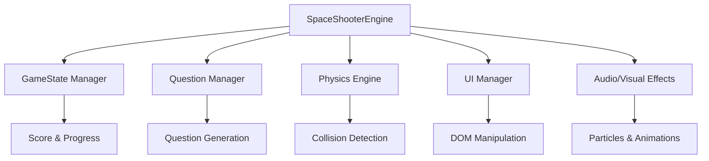

# 📚 Documentación Técnica - Matemáticas Space Shooter

## 📋 Índice
1. [Visión General](#visión-general)
2. [Arquitectura del Sistema](#arquitectura-del-sistema)
3. [Clases Principales](#clases-principales)
4. [Configuraciones](#configuraciones)
5. [Estructuras de Datos](#estructuras-de-datos)
6. [Algoritmos Complejos](#algoritmos-complejos)
7. [API Reference](#api-reference)
8. [Ejemplos de Uso](#ejemplos-de-uso)

---

## 🎯 Visión General

**Matemáticas Space Shooter** es un motor de juego educativo que combina mecánicas de space shooter con ejercicios matemáticos. El sistema está diseñado para ser modular, escalable y fácil de mantener.

### Tecnologías Utilizadas
- **JavaScript ES6+**: Lógica principal
- **HTML5 Canvas/DOM**: Renderizado
- **CSS3**: Estilos y animaciones
- **RequestAnimationFrame**: Loop de juego optimizado

### Estructura de Archivos
```
/assets
  /css      - Estilos del juego
  /js       - Motor principal
  /data     - Configuraciones y preguntas
/modules    - Páginas HTML de cada módulo
```

---

## 🏗️ Arquitectura del Sistema



---

## 🎮 Clases Principales

### SpaceShooterEngine

**Clase principal del motor de juego que orquesta todas las funcionalidades.**

```javascript
/**
 * Motor principal del juego Space Shooter Matemático
 * @class SpaceShooterEngine
 * @description Maneja el loop principal, física, UI y lógica educativa
 * 
 * @param {Object} config - Configuración del módulo específico
 * @param {Object} questions - Banco de preguntas del módulo
 * 
 * @example
 * const engine = new SpaceShooterEngine(Modulo1Config, Modulo1Questions);
 * engine.init();
 */
class SpaceShooterEngine {
    /**
     * Inicializa el motor del juego
     * @constructor
     * @param {ModuleConfig} config - Configuración del gameplay
     * @param {QuestionBank} questions - Preguntas y reflexiones educativas
     */
    constructor(config, questions) {
        this.config = config;
        this.questions = questions;
        this.state = this.createInitialState();
        this.keys = this.createKeyState();
        this.elements = {};
        this.gameStartTime = null;
        this.pauseSpawning = false; // Sistema anti-desincronización
    }
}
```

#### Métodos Principales

```javascript
/**
 * Inicializa todos los sistemas del juego
 * @method init
 * @description Cachea elementos DOM, configura controles y genera primera pregunta
 * @throws {Error} Si faltan elementos DOM críticos
 * 
 * @example
 * engine.init(); // Prepara el juego para comenzar
 */
init()

/**
 * Loop principal del juego usando RequestAnimationFrame
 * @method gameLoop
 * @description Actualiza física, renderiza elementos y maneja colisiones
 * @performance 60 FPS objetivo en dispositivos modernos
 * 
 * @example
 * // Se ejecuta automáticamente al iniciar el juego
 * this.gameLoop(); // 60 FPS loop
 */
gameLoop()

/**
 * Genera una nueva pregunta matemática y limpia enemigos anteriores
 * @method generateNewQuestion
 * @description Implementa sistema anti-desincronización para evitar respuestas mezcladas
 * @complexity O(1) - Operación constante
 * 
 * @example
 * // Se ejecuta automáticamente tras respuesta correcta
 * this.generateNewQuestion();
 */
generateNewQuestion()
```

---

## ⚙️ Configuraciones

### ModuleConfig Structure

```javascript
/**
 * Configuración de gameplay para cada módulo
 * @typedef {Object} ModuleConfig
 * @property {GameInfo} gameInfo - Información visual del módulo
 * @property {Gameplay} gameplay - Mecánicas y dificultad
 * @property {Scoring} scoring - Sistema de puntuación
 * @property {Difficulty} difficulty - Progresión de dificultad
 * @property {Visual} visual - Efectos y animaciones
 */

/**
 * Información básica del módulo
 * @typedef {Object} GameInfo
 * @property {string} title - Título mostrado en pantalla
 * @property {string} subtitle - Descripción del módulo
 * @property {string} instruction - Instrucciones de juego
 */

/**
 * Configuración de mecánicas de juego
 * @typedef {Object} Gameplay
 * @property {number} enemySpeed - Velocidad de enemigos (0.1-2.0)
 * @property {number} bulletSpeed - Velocidad de proyectiles
 * @property {number} spaceshipSpeed - Velocidad de nave
 * @property {number} spawnInterval - Intervalo entre enemigos (ms)
 * @property {number} correctEnemyChance - Probabilidad de respuesta correcta (0.0-1.0)
 * @property {number} maxEnemiesOnScreen - Máximo enemigos simultáneos
 * @property {number} levelUpRequirement - Respuestas correctas para subir nivel
 * @property {number} particleCount - Partículas en explosiones
 */

// Ejemplo de configuración balanceada
const ExampleConfig = {
    gameInfo: {
        title: "🔢 Space Shooter - Ejemplo",
        subtitle: "¡Descripción motivadora!",
        instruction: "Instrucciones claras y concisas"
    },
    gameplay: {
        enemySpeed: 0.6,              // Velocidad moderada
        bulletSpeed: 4,               // Velocidad estándar
        spaceshipSpeed: 1.5,          // Responsivo pero controlable
        spawnInterval: 3500,          // Balance pensamiento/acción
        correctEnemyChance: 0.4,      // 40% respuestas correctas
        maxEnemiesOnScreen: 3,        // No overwhelm
        levelUpRequirement: 5,        // Progresión regular
        particleCount: 8              // Efectos visibles sin lag
    }
};
```

### QuestionBank Structure

```javascript
/**
 * Banco de preguntas de un módulo
 * @typedef {Object} QuestionBank
 * @property {string} subject - Tema matemático
 * @property {string} description - Descripción del contenido
 * @property {Question[]} questions - Array de preguntas
 * @property {Function} generateWrongAnswers - Generador de distractores
 * @property {Reflection} reflection - Contenido educativo post-juego
 */

/**
 * Estructura de una pregunta individual
 * @typedef {Object} Question
 * @property {string} question - Enunciado matemático
 * @property {string} answer - Respuesta correcta (como string)
 * @property {string} type - Categoría de operación
 * @property {number} difficulty - Nivel de dificultad (1-3)
 * @property {string} topic - Subtema específico
 * @property {number} timeLimit - Tiempo límite en milisegundos
 */

// Ejemplo de pregunta bien estructurada
const ExampleQuestion = {
    question: "-8 + 5",           // Clara y concisa
    answer: "-3",                 // String para consistencia
    type: "suma",                 // Para generar distractores
    difficulty: 1,                // 1=básico, 2=intermedio, 3=avanzado
    topic: "Suma con negativos",  // Para analytics futuro
    timeLimit: 10000             // 10 segundos máximo
};
```

---

## 🧮 Algoritmos Complejos

### 1. Sistema Anti-Desincronización

**Problema:** Enemigos con respuestas de preguntas anteriores aparecen mezclados.

```javascript
/**
 * Previene la desincronización entre preguntas y enemigos
 * @algorithm Anti-Desync System
 * @complexity O(1) - Verificación constante
 * @description Implementa pausas temporales y validación de IDs
 */
function preventDesyncAlgorithm() {
    // 1. Pausa temporal del spawning
    this.pauseSpawning = true;
    
    // 2. Limpieza de enemigos anteriores
    this.cleanupEnemiesOnly();
    
    // 3. Asignación de ID único a enemigos
    const enemy = {
        questionId: this.state.currentQuestionIndex,
        questionText: this.state.currentQuestion.question,
        // ... otros propiedades
    };
    
    // 4. Validación en colisiones
    if (enemy.questionId !== this.state.currentQuestionIndex) {
        console.error('DESYNC DETECTED!');
        // Auto-corrección implementada
    }
    
    // 5. Reanudación controlada después de 300ms
    setTimeout(() => {
        this.pauseSpawning = false;
    }, 300);
}
```

### 2. Generador de Respuestas Incorrectas

**Objetivo:** Crear distractores plausibles educativamente válidos.

```javascript
/**
 * Genera respuestas incorrectas pedagógicamente útiles
 * @algorithm Distractor Generation
 * @param {string} correctAnswer - Respuesta correcta
 * @param {string} questionType - Tipo de operación matemática
 * @returns {string[]} Array de distractores únicos
 * @complexity O(n) donde n = número de distractores generados
 * 
 * @description Crea errores comunes que los estudiantes realmente cometen:
 * - Error de signo (muy común en enteros)
 * - Error off-by-one (±1)
 * - Error de magnitud (×2, ÷2)
 * - Error de operación (valor absoluto cuando no corresponde)
 */
generateWrongAnswers(correctAnswer, questionType) {
    const correct = parseInt(correctAnswer);
    const wrongAnswers = [];
    
    // Estrategias específicas por tipo de pregunta
    switch(questionType) {
        case 'suma':
        case 'resta':
            wrongAnswers.push(
                (-correct).toString(),           // Error de signo
                (correct + 1).toString(),        // Off-by-one +
                (correct - 1).toString(),        // Off-by-one -
                (Math.abs(correct)).toString(),  // Valor absoluto erróneo
                (correct * 2).toString()         // Error de duplicación
            );
            break;
            
        case 'valor_absoluto':
            wrongAnswers.push(
                (-Math.abs(correct)).toString(), // Signo incorrecto
                (Math.abs(correct) + 1).toString(),
                (Math.abs(correct) - 1).toString()
            );
            break;
    }
    
    // Filtrado y unicidad
    return [...new Set(wrongAnswers)]
        .filter(ans => ans !== correctAnswer && !isNaN(parseInt(ans)))
        .slice(0, 5); // Máximo 5 distractores
}
```

### 3. Sistema de Colisiones Optimizado

**Challenge:** Detectar colisiones pixel-perfect de manera eficiente.

```javascript
/**
 * Detecta colisiones usando Bounding Box optimizado
 * @algorithm AABB Collision Detection
 * @param {GameObject} bullet - Proyectil del jugador
 * @param {GameObject} enemy - Enemigo en pantalla
 * @returns {boolean} true si hay colisión
 * @complexity O(1) - Verificación constante
 * @performance Optimizado para 60 FPS con múltiples objetos
 */
isColliding(bullet, enemy) {
    // Validación temprana para evitar cálculos innecesarios
    if (!bullet.element || !enemy.element) return false;
    
    // Obtener bounding rectangles una sola vez
    const bulletRect = bullet.element.getBoundingClientRect();
    const enemyRect = enemy.element.getBoundingClientRect();
    
    // AABB (Axis-Aligned Bounding Box) collision detection
    // Optimizado: usa operaciones lógicas rápidas
    return bulletRect.left < enemyRect.right &&    // Bullet izquierda < Enemy derecha
           bulletRect.right > enemyRect.left &&     // Bullet derecha > Enemy izquierda
           bulletRect.top < enemyRect.bottom &&     // Bullet arriba < Enemy abajo
           bulletRect.bottom > enemyRect.top;       // Bullet abajo > Enemy arriba
}

/**
 * Verifica todas las colisiones del frame actual
 * @method checkCollisions
 * @complexity O(n*m) donde n=bullets, m=enemies
 * @optimization Early termination cuando se encuentra colisión
 */
checkCollisions() {
    // Optimización: romper loops anidados en primera colisión
    bulletLoop: for (let bulletIndex = 0; bulletIndex < this.state.bullets.length; bulletIndex++) {
        const bullet = this.state.bullets[bulletIndex];
        
        for (let enemyIndex = 0; enemyIndex < this.state.enemies.length; enemyIndex++) {
            const enemy = this.state.enemies[enemyIndex];
            
            if (this.isColliding(bullet, enemy)) {
                this.handleCollision(bullet, enemy, bulletIndex, enemyIndex);
                break bulletLoop; // Salir de ambos loops
            }
        }
    }
}
```

### 4. Sistema de Partículas Eficiente

**Objetivo:** Efectos visuales impactantes sin comprometer performance.

```javascript
/**
 * Crea sistema de partículas con cleanup automático
 * @algorithm Particle System with Memory Management
 * @param {number} x - Posición X de explosión
 * @param {number} y - Posición Y de explosión
 * @param {boolean} isCorrect - Determina color de partículas
 * @complexity O(n) donde n = particleCount
 * @memory Auto-cleanup previene memory leaks
 */
createParticles(x, y, isCorrect) {
    if (!this.elements.gameArea) return;
    
    const particleCount = this.config.gameplay.particleCount;
    const color = isCorrect ? '#00ff88' : '#ff4444';
    
    // Pre-calcular valores para optimización
    const angleStep = (Math.PI * 2) / particleCount;
    
    for (let i = 0; i < particleCount; i++) {
        // Crear elemento DOM una sola vez
        const particle = this.createParticleElement(x, y, color);
        
        // Física optimizada: pre-calcular ángulo
        const angle = angleStep * i;
        const speed = 50 + Math.random() * 100;
        const vx = Math.cos(angle) * speed;
        const vy = Math.sin(angle) * speed;
        
        // Objeto partícula con auto-cleanup
        const particleData = {
            element: particle,
            x: x,
            y: y,
            vx: vx,
            vy: vy,
            life: this.config.visual.particleDuration,
            startTime: performance.now() // Para interpolación suave
        };
        
        this.state.particles.push(particleData);
        this.elements.gameArea.appendChild(particle);
    }
}

/**
 * Actualiza todas las partículas con interpolación suave
 * @method updateParticles
 * @description Usa deltaTime para movimiento frame-independent
 * @memory Remueve partículas muertas automáticamente
 */
updateParticles() {
    // Iterar hacia atrás para remover elementos de manera segura
    for (let i = this.state.particles.length - 1; i >= 0; i--) {
        const particle = this.state.particles[i];
        
        // Actualizar vida de partícula
        particle.life -= this.state.deltaTime;
        
        if (particle.life <= 0) {
            // Cleanup: remover del DOM y del array
            if (particle.element && particle.element.parentNode) {
                particle.element.parentNode.removeChild(particle.element);
            }
            this.state.particles.splice(i, 1);
        } else {
            // Actualizar posición con frame-independent movement
            const timeRatio = this.state.deltaTime / 16; // 16ms = 60 FPS baseline
            particle.x += particle.vx * timeRatio;
            particle.y += particle.vy * timeRatio;
            
            // Actualizar DOM
            if (particle.element) {
                particle.element.style.left = particle.x + 'px';
                particle.element.style.top = particle.y + 'px';
                
                // Fade out suave
                const opacity = particle.life / this.config.visual.particleDuration;
                particle.element.style.opacity = opacity;
            }
        }
    }
}
```

---

## 🔧 API Reference

### Eventos del Motor

```javascript
/**
 * Eventos principales del sistema
 * @namespace GameEvents
 */

// Inicio de juego
engine.on('gameStart', () => {
    console.log('🚀 Juego iniciado');
});

// Respuesta correcta
engine.on('correctAnswer', (data) => {
    console.log('✅ Respuesta correcta:', data.answer);
    console.log('📊 Puntos ganados:', data.points);
});

// Finalización de módulo
engine.on('moduleComplete', (stats) => {
    console.log('🏆 Módulo completado');
    console.log('📈 Estadísticas:', stats);
});
```

### Métodos Públicos

```javascript
/**
 * API pública del motor
 * @namespace PublicAPI
 */

// Control de juego
engine.init();                    // Inicializar sistema
engine.startGame();              // Comenzar partida
engine.pauseGame();              // Pausar/reanudar
engine.restartGame();            // Reiniciar desde cero
engine.stopGame();               // Detener completamente

// Información de estado
engine.getScore();               // Puntuación actual
engine.getAccuracy();           // Precisión percentage
engine.getCurrentQuestion();    // Pregunta activa
engine.getProgress();           // Progreso 0-100%

// Configuración en tiempo real
engine.setDifficulty(level);    // Ajustar dificultad
engine.setSpeed(multiplier);    // Modificar velocidad
engine.enableDebugMode(true);   // Activar debug
```

---

## 📝 Ejemplos de Uso

### Inicialización Básica

```javascript
// 1. Cargar configuración y preguntas
import { Modulo1Config, Modulo1Questions } from './assets/data/modulo1-questions.js';

// 2. Crear instancia del motor
const gameEngine = new SpaceShooterEngine(Modulo1Config, Modulo1Questions);

// 3. Inicializar cuando DOM esté listo
document.addEventListener('DOMContentLoaded', () => {
    try {
        gameEngine.init();
        console.log('✅ Motor inicializado correctamente');
    } catch (error) {
        console.error('❌ Error en inicialización:', error);
    }
});
```

### Configuración Personalizada

```javascript
// Crear configuración custom
const CustomConfig = {
    ...Modulo1Config,
    gameplay: {
        ...Modulo1Config.gameplay,
        enemySpeed: 0.8,              // Más rápido
        correctEnemyChance: 0.6,      // Más respuestas correctas
        spawnInterval: 2000           // Spawning más frecuente
    }
};

// Usar configuración personalizada
const customEngine = new SpaceShooterEngine(CustomConfig, Modulo1Questions);
```

### Manejo de Eventos

```javascript
// Setup de event listeners
gameEngine.addEventListener('questionChange', (event) => {
    console.log('Nueva pregunta:', event.detail.question);
    
    // Analytics custom
    trackQuestionView(event.detail.questionId);
});

gameEngine.addEventListener('gameComplete', (event) => {
    const stats = event.detail;
    
    // Guardar progreso
    saveProgress({
        module: stats.moduleId,
        score: stats.finalScore,
        accuracy: stats.accuracy,
        completedAt: new Date()
    });
    
    // Mostrar achievements
    checkAchievements(stats);
});
```

---

## 🚀 Guía de Contribución

### Agregar Nuevo Módulo

```javascript
// 1. Crear archivo de configuración
// /assets/data/modulo7-questions.js

const Modulo7Config = {
    gameInfo: {
        title: "🔺 Space Shooter - Geometría",
        subtitle: "¡Calcula áreas y perímetros espaciales!",
        instruction: "Resuelve problemas geométricos para salvar la galaxia"
    },
    // ... resto de configuración
};

const Modulo7Questions = {
    subject: "Geometría Básica",
    description: "Áreas, perímetros y figuras geométricas",
    questions: [
        {
            question: "Área de un cuadrado de 5cm de lado",
            answer: "25",
            type: "area",
            difficulty: 1,
            topic: "Área de cuadrados",
            timeLimit: 8000
        }
        // ... más preguntas
    ],
    generateWrongAnswers: function(correctAnswer, questionType) {
        // Lógica específica para geometría
    },
    reflection: {
        title: "Reflexión Geométrica",
        content: "La geometría en el mundo profesional...",
        feedback: "El pensamiento espacial te distingue..."
    }
};

// 2. Crear página HTML
// /modules/modulo7_geometria.html
// (Seguir plantilla de módulos existentes)

// 3. Agregar al índice principal
// /index.html - agregar nueva tarjeta de módulo
```

### Optimización de Performance

```javascript
/**
 * Mejores prácticas para mantener 60 FPS
 * @guide Performance Guidelines
 */

// ✅ HACER
function goodPractice() {
    // Cachear elementos DOM
    const element = document.getElementById('gameArea');
    
    // Usar requestAnimationFrame
    const gameLoop = () => {
        update();
        requestAnimationFrame(gameLoop);
    };
    
    // Pooling de objetos
    const bulletPool = [];
    function getBullet() {
        return bulletPool.pop() || createBullet();
    }
}

// ❌ EVITAR
function badPractice() {
    // No buscar elementos en cada frame
    document.getElementById('gameArea'); // ❌ En game loop
    
    // No usar setTimeout para animaciones
    setTimeout(update, 16); // ❌ Inconsistente
    
    // No crear objetos constantemente
    const bullet = new Bullet(); // ❌ En cada disparo
}
```

Esta documentación proporciona una guía completa para entender, mantener y extender el sistema de Space Shooter Matemático, con especial atención a los algoritmos complejos y las mejores prácticas de desarrollo.
